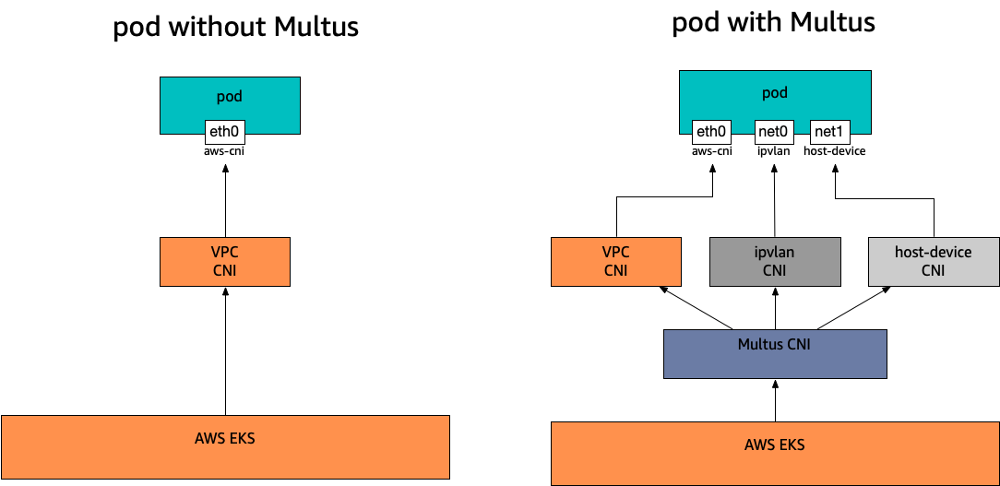

# Multus Setup Guide

This repo contains Multus setup instructions showing how to provision EKS cluster and nodegroups using CloudFormation and CDK. You can use these patterns to help deploy your own workloads quickly.

Important: this application uses various AWS services and there are costs associated with these services after the Free Tier usage - please see the AWS Pricing page for details. 
You are responsible for any AWS costs incurred. No warranty is implied in this example.

Credits: This repository consolidated the knowledge and steps from [cfn-nodegroup-for-multus-cni](https://github.com/aws-samples/cfn-nodegroup-for-multus-cni), [cdkMultusNodeGroup](https://github.com/jungy-aws/cdkMultusNodeGroup) and [AWS-Immersion-Day](https://github.com/crosscom/AWS-Immersion-Day).  

Multus CNI is a container network interface (CNI) plugin for EKS that enables attaching multiple interfaces for pods. In EKS, each pod has one network interface assigned by the AWS [VPC-CNI](https://docs.aws.amazon.com/eks/latest/userguide/pod-networking.html) plugin. With Multus, you can create a multi-homed pod that has multiple interfaces. This is accomplished by Multus acting as a "meta-plugin", a CNI plugin that can call multiple other CNI plugins. AWS support for Multus comes with VPC CNI as the default delegate plugin configured. Please visit upstream [link](https://github.com/k8snetworkplumbingwg/multus-cni) for comprehensive documentation.



## Requirements

* AWS CLI already configured with Administrator permission (helpful if you would like to use CDK from your laptop).

## Deployment Instructions

1. [Create an AWS account](https://portal.aws.amazon.com/gp/aws/developer/registration/index.html) if you do not already have one and login.

1. [Create EC2 SSH Key Pair](https://docs.aws.amazon.com/ground-station/latest/ug/create-ec2-ssh-key-pair.html)

1. [Install Git](https://git-scm.com/book/en/v2/Getting-Started-Installing-Git) 

1. Create a new directory and navigate to that directory in a terminal.

1. Clone this repo:

```
git clone https://github.com/aws-samples/eks-install-guide-for-multus
```

## Steps

1. [Provision Infra, EKS Cluster, and Bastion Host](./cfn/templates/infra/README.md).
2. [Self Managed Nodegroup via CloudFormation](./cfn/templates/nodegroup/README.md).
3. [Automated Multus pod IP management on EKS](https://github.com/aws-samples/eks-automated-ipmgmt-multus-pods).
4. [Optional, CDK Managed Nodegroup](./cdk/README.md).

Each subdirectory contains additional installation and usage instructions. 

----
Copyright 2021 Amazon.com, Inc. or its affiliates. All Rights Reserved.
