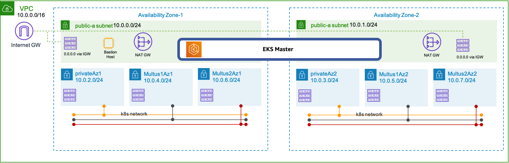

# EKS Cluster and Infra Setup

## Prerequisites
* Please use [cfn/templates/infra/eks-infra.yaml](./eks-infra.yaml) for cluster and infra provision.
* This creates VPC, public/private subnets, subnet route tables, IGW, NAT-GW, Security Groups, EKS Cluster and Bastion Instance

## Create Environment with CloudFormation
* Type "CloudFormation" at search service section and go to CloudFormation.
* Create Stack -> upload a template file -> Choose file (select downloaded "./eks-infra.yaml").
* You might consider to use 'eks-multus-cluster' for the name of your cluster as well the Cloudformation stack.




## Login to Bastion Host 
* Usually in eksworkshop, we guide customer to experience Cloud9 (AWS IDE environment). But in this workshop, plan is to provide a general environment with your own Bastion Host EC2, where you have to install kubectl tools and other tools as needed.
* (General)
    * We can use EC2 Instance Connect to login to EC2 instance.
    * EC2->Instances->"connect" (right top corner of screen). 
    * click "connect"

* (MAC user) Log in from your laptop
    * Let's use key pair downloaded to access to the instance.

  ````
  chmod 600 ee-default-keypair.pem
  ssh-add ee-default-keypair.pem
  ssh -A ec2-user@54.208.182.244
  ````

    * Copy AWS credentials; be mindful that you have to use your own not below one.

  ````
  export AWS_DEFAULT_REGION=us-east-1
  export AWS_ACCESS_KEY_ID=ASIA..
  export AWS_SECRET_ACCESS_KEY=4wyDA..
  export AWS_SESSION_TOKEN=IQo...
  ````

    * Try whether AWS confidential is already configured well

    ````
    aws sts get-caller-identity
    {
      "Account": "XXXXXXXX", 
      "UserId": "AROAV2K6K7UQPEU2EAAAA:MasterKey", 
      "Arn": "arn:aws:sts::XXXXXXXXXXXXX:assumed-role/TeamRole/MasterKey"
    }
    ````

* (Window user) Log in from your laptop 
    * Please use PuTTy and refer to the guide, https://docs.aws.amazon.com/AWSEC2/latest/UserGuide/putty.html

## Make a Bastion Host to be a kubectl client

* Download kubectl. 

  ````
  curl -o kubectl https://amazon-eks.s3.us-west-2.amazonaws.com/1.19.6/2021-01-05/bin/linux/amd64/kubectl
  curl -o kubectl.sha256 https://amazon-eks.s3.us-west-2.amazonaws.com/1.19.6/2021-01-05/bin/linux/``amd64``/kubectl.sha256
  openssl sha1 -sha256 kubectl
  chmod +x ./kubectl
  mkdir -p $HOME/bin && cp ./kubectl $HOME/bin/kubectl && export PATH=$PATH:$HOME/bin
  echo 'export PATH=$PATH:$HOME/bin' >> ~/.bashrc
  kubectl version —short —client
  ````

* Check your name of EKS cluster (from CloudFormation output or EKS console (service search -> EKS)) - you provided this name in Step3 CloudFormation creation.

* Config kubeconfig with EKS CLI (*please be mindful to use your own cluster name in below instead of eks-my-first-stack), you have to check your EKS cluster name you created from the CloudFormation*)
  ````
  aws eks update-kubeconfig --name=eks-multus-cluster
  ````

* Verify kubectl command
  ````
  kubectl get svc
  NAME         TYPE        CLUSTER-IP   EXTERNAL-IP   PORT(S)   AGE
  kubernetes   ClusterIP   172.20.0.1   <none>        443/TCP   31m
  ````

* Verify it from AWS CLI
  ````
  aws eks describe-cluster --name eks-multus-cluster
  ````

## Clean up environment
* Go to CloudFormation and delete cluster multus-cluster
